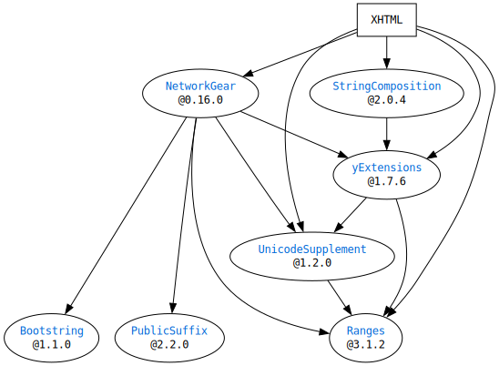

# What is `SwiftXHTML`?

`SwiftXHTML` will provide some functions related to XHTML.  
It was originally written as a part of [SwiftCGIResponder](https://github.com/YOCKOW/SwiftCGIResponder),
and is intended to be used by it.


# Requirements

- Swift 5
- macOS(>=10.15) or Linux

## Dependencies




# Usage

## As a parser

```Swift
import XHTML

let string = """
<?xml version="1.0" encoding="UTF-8"?>
<!DOCTYPE html>
<html xmlns="http://www.w3.org/1999/xhtml">
  <head>
    <title>Title</title>
  </head>
  <body>
    <div id="main">
      <h1>My Page</h1>
      <p>Welcome to my page.</p>
    </div>
  </body>
</html>
"""

let document = try Parser.parse(string.data(using: .utf8)!)

print(document.prolog.xmlVersion) // -> "1.0"
print(document.element(for: "main")!.name) // -> "div"

```


## As a generator

```Swift
import XHTML

let page = Document.template(title: "Title",
                             contents:[.text("It's my page.")])
print(page.xhtmlString)

/*
-- OUTPUT --
<?xml version="1.0" encoding="utf-8"?>
<!DOCTYPE html>
<html xmlns="http://www.w3.org/1999/xhtml"><head><title>Title</title></head><body>It&apos;s my page.</body></html>

*/

page.rootElement.body!.append(.comment("This is a comment."))
print(page.prettyXHTMLString)

/*
-- OUTPUT --
<?xml version="1.0" encoding="utf-8"?>
<!DOCTYPE html>
<html xmlns="http://www.w3.org/1999/xhtml">
    <head><title>Title</title></head>
    <body>
        It&apos;s my page.
        <!--This is a comment.-->
    </body>
</html>

*/
```


## What are not supported yet...

- XPath
- CSS selector
- CSS parser


# License

MIT License.  
See "LICENSE.txt" for more information.

